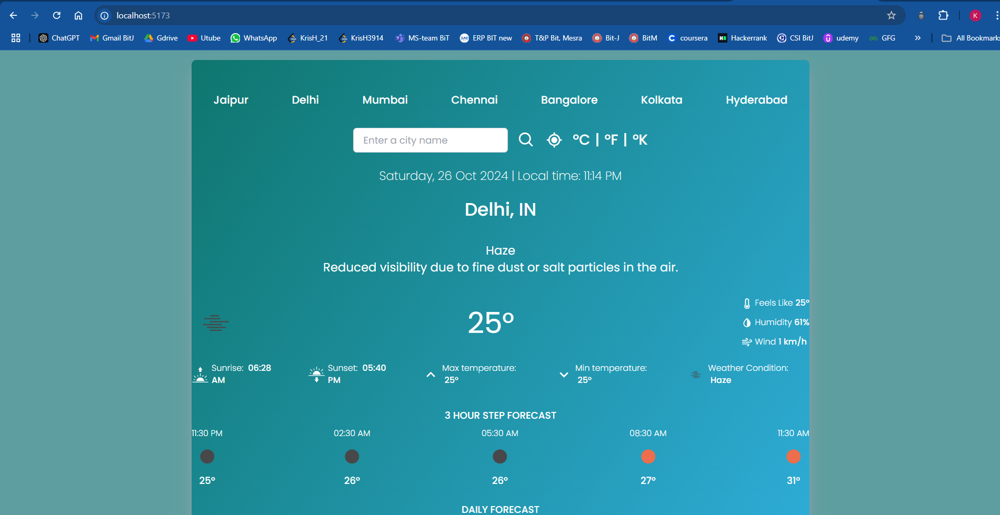
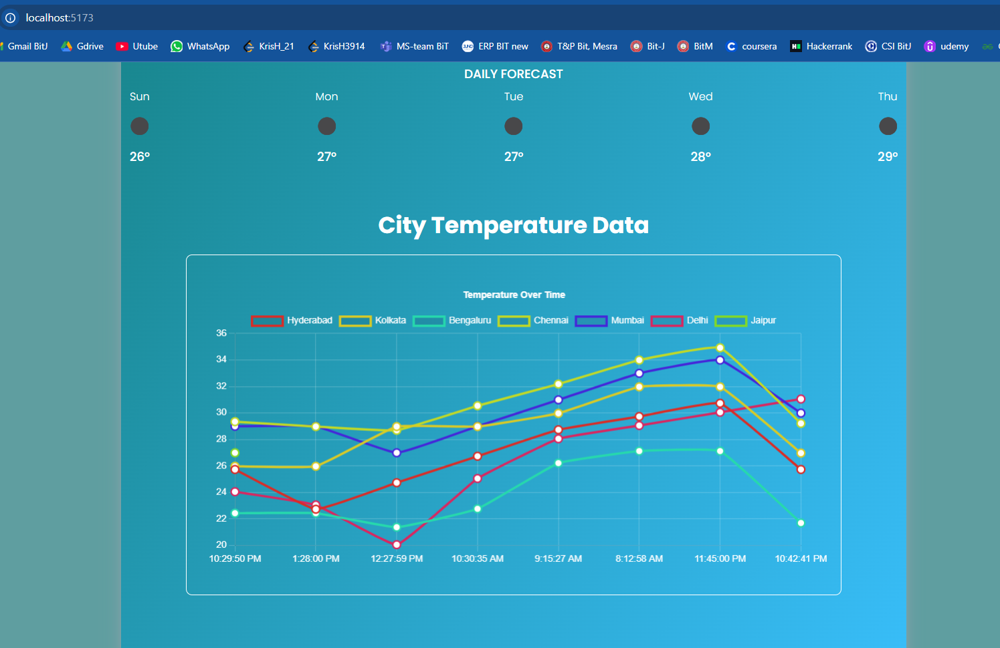

# 🌤️ Real-Time Weather Monitoring System with Rollups and Aggregates





## Overview

The Weather Monitoring App is a real-time service designed to provide weather data for major Indian cities. This application allows users to retrieve current weather information, including temperature, humidity, and weather conditions, as well as access historical weather data stored in a MongoDB database. Built with the MERN stack (MongoDB, Express, React, Node.js), the app fetches data from the OpenWeatherMap API and displays it in a user-friendly interface. Users can view detailed weather information for specific cities and monitor temperature trends over time.

## Demo Video Link:

https://drive.google.com/file/d/1QAIEasZz3i2NpKwc3QR2wi9euVXlJun1/view

## Project Structure

- `client/`: Contains the React frontend code.

  - `public/`: Contains static files like index.html.
  - `src/`: Contains the source code for the React application.
    - `components/`: Contains React components used in the application.
      - `NavigationButtons.jsx`: Component for navigation buttons.
      - `Inputs.jsx`: Component for input fields.
      - `TimeAndLocation.jsx`: Component to display time and location.
      - `WeatherDetails.jsx`: Component to display detailed weather information.
      - `Forecast.jsx`: Component to display weather forecast.
      - `TemperatureHistory.jsx`: Component to display temperature history.
      - `ThresholdAlert.jsx`: Component to display threshold alerts.
      - `WeatherDashboard.jsx`: Component to display the weather dashboard.
      - `App.jsx`: Main application component.
      - `index.jsx`: Entry point for the React application.
    - `services/`: Contains service files for API calls.
      - `weatherService.js`: Service file for weather-related API calls.
    - `styles/`: Contains CSS files for styling.
      - `App.css`: Main CSS file for the application.
    - `.env`: Example environment variables file for the client.
  - `package.json`: Contains dependencies and scripts for the client.

- `server/`: Contains the Express backend code.

  - `db/`: Contains database connection files.
    - `connect.js`: File to connect to MongoDB.
  - `models/`: Contains Mongoose models.
    - `Weather.js`: Mongoose model for weather data.
  - `index.js`: Entry point for the Express server.
  - `.env`: Example environment variables file for the server.
  - `package.json`: Contains dependencies and scripts for the server.
  - `.gitignore`: Specifies files and directories to be ignored by Git.

- `README.md`: Documentation file for the project.

This structure provides a clear separation of concerns, making it easier to manage and maintain the application.

## Design Choices

1. **MERN Stack**: We chose the MERN (MongoDB, Express.js, React.js, Node.js) stack for its flexibility and JavaScript ecosystem.

2. **Real-time Updates**: The system fetches weather data at configurable intervals to provide near real-time updates.

3. **Daily Summaries**: We generate daily summaries to provide aggregated insights, which are useful for trend analysis.

4. **Alerting System**: The alerting system is designed to be configurable and can be easily extended to include more complex conditions.

5. **Visualization**: We use Chart.js for creating visual representations of the weather data, making it easier for users to understand trends.

6. **Modular Architecture**: The project is structured with separate components and services for better organization and maintainability.

## 🚀 Features

- ### Display Real-Time Weather Data:
  - Weather conditions, temperature, humidity, and more for current locations and major metro cities.
  - Uses Axios to fetch data from weather APIs.
- ### Real-Time Data Updates:
  - Automatically updates weather data every 10 minutes using setInterval().
  - Handles asynchronous data fetch with async/await in the JavaScript event loop.
- ### Temperature Conversion:
  - Converts temperatures between Celsius, Fahrenheit, and Kelvin using an O(1) time complexity formula.
    
- ### Data Storage and Analysis:
  - Stores weather data in MongoDB for future analysis and visualization.
  - Enables historical data plotting, such as temperature trends over time.
- ### Weather Summaries:
  - Generates summaries using the Gemini-1.5 Pro Model, selected for its faster and more efficient output compared to Flash.

- ### Interactive Data Visualization:
  - Displays temperature trends in a Line Graph using Chart.js and react-chartjs-2.
  - The X-axis represents the time of data updates, while the Y-axis shows the temperature.
- ### Security:
  - Implements IP hashing to mitigate DDoS attacks.
  - Requests exceeding a threshold from the same IP trigger a 2-second response delay.
 
- ### Alert Thresholds:
  - Users can set temperature thresholds and receive alerts when the temperature exceeds those limits.
  - Uses EmailJS to send alert notifications.
- ### Additional Weather Information:
  - Provides extra data such as humidity, wind speed, minimum and maximum temperatures, and average temperature.

- ### Responsive Design:
  - Ensures the website is fully responsive and adapts seamlessly to all screen sizes.

## API Endpoints

### Get Weather Data for All Cities

- **Endpoint:** `GET /weather-data`
- **Description:** Fetches the latest weather data for all monitored cities. Returns up to the last 10 entries for each city.
- **Response:**
  ```json
  [
    {
      "name": "City Name",
      "country": "Country Code",
      "temp": "Temperature",
      "feels_like": "Feels Like Temperature",
      "temp_min": "Minimum Temperature",
      "temp_max": "Maximum Temperature",
      "timestamp": "Timestamp of the data",
      "createdAt": "Time of creation",
      "updatedAt": "Time of updation"
    }
  ]
  ```

### Get Weather Data for a Specific City

- **Endpoint:** `GET /weather-data/city`
- **Description:** Fetches the latest weather data for a specific city. Returns up to the last 10 entries for the specified city.
- **Parameters:**
  - `city`: The name of the city for which weather data is requested (case-sensitive).
- **Response:**
  ```json
  [
    {
      "name": "City Name",
      "country": "Country Code",
      "temp": "Temperature",
      "feels_like": "Feels Like Temperature",
      "temp_min": "Minimum Temperature",
      "temp_max": "Maximum Temperature",
      "timestamp": "Timestamp of the data",
      "createdAt": "Time of creation",
      "updatedAt": "Time of updation"
    }
  ]
  ```

### Monitored Cities

- Jaipur
- Delhi
- Mumbai
- Chennai
- Bangalore
- Kolkata
- Hyderabad
- Ranchi

## Setup and Installation

1. Clone the repository.

   ```
   git clone https://github.com/SaurabhSingh2115/Weather-Monitoring-App.git
   ```

2. Install the dependencies for both the backend and frontend.

   **server/**

   ```
   cd Weather-Monitoring-App/server
   npm install
   ```

   **client/**

   ```
   cd ../client
   npm install
   ```

3. Start the **backend** application.

   **server/**

   ```
   nodemon index.js
   ```

4. Start the **frontend** application in a new terminal.

   **client/**

   ```
   npm run dev
   ```

   For the time being, I have provided my OpenWeatherMap API key and MongoDB connection string in the code. It is better to use your own and store them inside a .env file for security reasons.
   <br>

## Accessing the Application

- Frontend: [http://localhost:5173](http://localhost:5173)
- Backend: [http://localhost:5000](http://localhost:5000)
<br>

## 🔮 Future Enhancements

- ### User Authentication:
  - Add user profiles to save personalized settings and thresholds.
- ### Enhanced Data Visualization:
  - Add additional chart types (e.g., bar charts, pie charts) for different weather metrics.
- ### API Integration:
  - Expand support to more cities and integrate with multiple weather APIs for improved accuracy.


<br><br>

## Profile-Info
- Email:  krishagrawal3914@gmail.com
- Portfolio: https://krishfolio.vercel.app/
- LinkedIn: https://www.linkedin.com/in/krishagrawal-softwaredevelopment/
